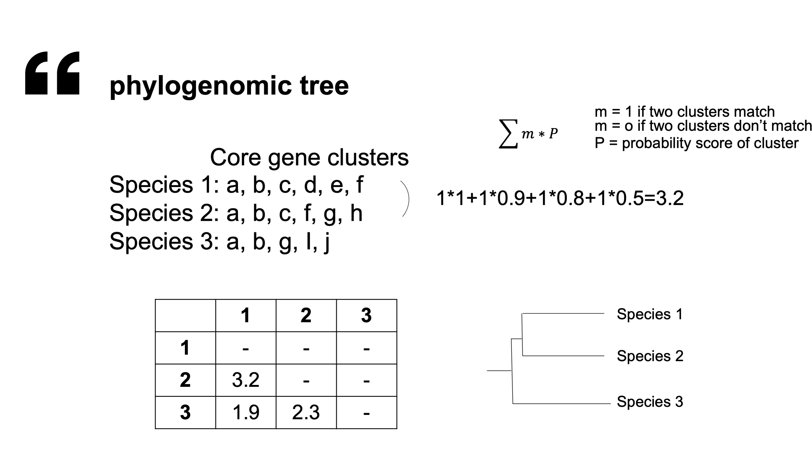

# Phylogenomic tree

## data instruction

* Species: 491
* Sequence: 
* Subnet: 95140/95259
* Subnet contain essentail genes: 1267 

## phylogenomic tree

* Predicted model: glm(DEG ~ nodes + species + mean_edge + links + density)

